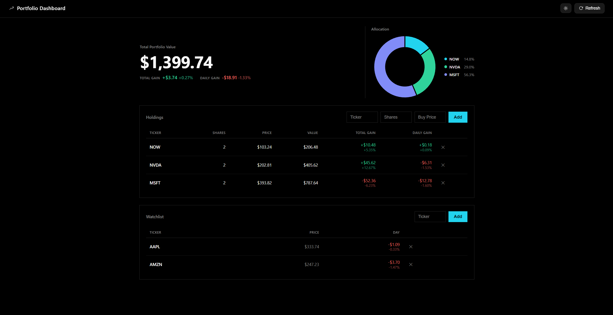

# Portfolio Dashboard

A simple stock portfolio dashboard.

Add your holdings, see what they're worth, and track your total and daily performance in real time.

**Live:** https://portfolio-tracker-lv7o.onrender.com



---

## Features

- Live prices from Yahoo Finance
- Total and daily gain/loss (both $ and %)
- Portfolio allocation chart
- Watchlist for tracking other stocks
- Light / dark mode (saved locally)
- Works on mobile
- No login — everything is stored in your browser

---

## How it works

Flask serves a single page and a `/price` endpoint.

The browser stores your portfolio in `localStorage` and requests prices from the backend when needed.

```
browser → Flask (/price) → yfinance → Yahoo Finance
```

---

## Structure

- `app.py` — Flask server and `/price` endpoint
- `prices.py` — fetches stock data
- `templates/index.html` — main page
- `static/app.js` — portfolio logic (add/remove/render)
- `static/style.css` — styling + responsive layout

---

## Tech

Python, Flask, yfinance, vanilla JavaScript, Chart.js

No database. No frontend framework.

---

## Running locally

```bash
git clone https://github.com/amenb106-blip/portfolio-tracker.git
cd portfolio-tracker
pip install -r requirements.txt
python app.py
```

Open http://127.0.0.1:5000

---

## Notes

- Prices come from Yahoo Finance and may be delayed (~15 min)
- Buying the same ticker twice merges into one position with a weighted average cost
- Invalid tickers show an error instead of breaking the app

---

## Why I built this

I wanted a simple way to track my portfolio without logging into anything or storing data on a server, so I built a lightweight dashboard that runs mostly in the browser.
